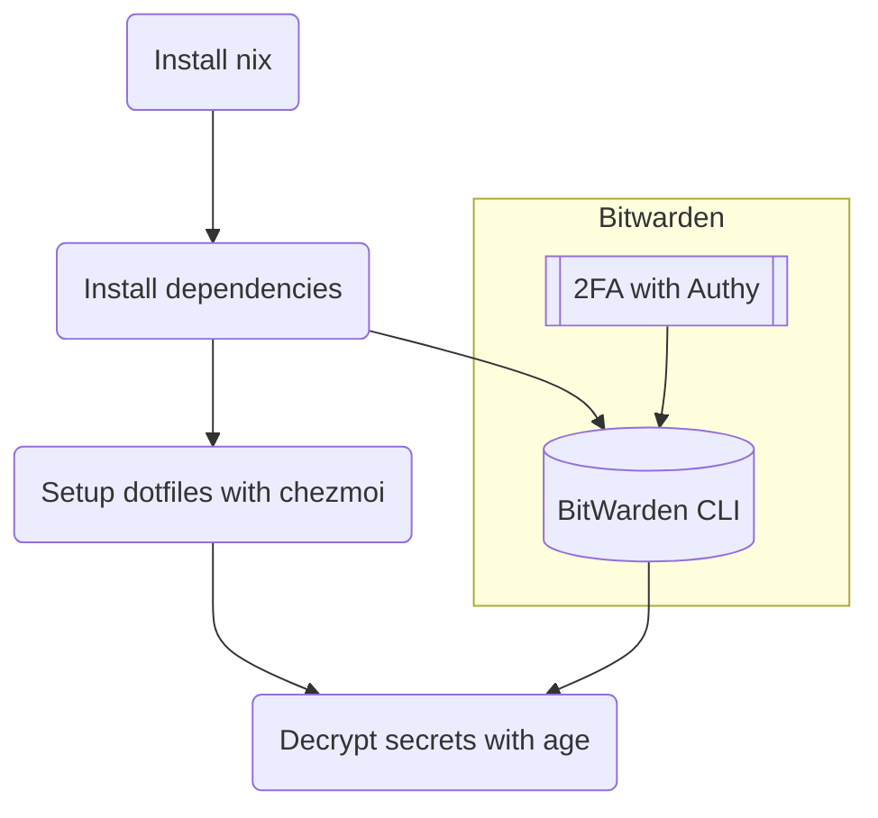

# Tolki's Dotfiles

## TL;DR

### Flow



### Install `nix`

```sh
curl -L https://nixos.org/nix/install | sh -s -- --daemon
```

### Install dependencies

```sh
nix-env -iA \
    nixpkgs.age \
    nixpkgs.atuin \
    nixpkgs.bat \
    nixpkgs.bitwarden-cli \
    nixpkgs.bottom \
    nixpkgs.chezmoi \
    nixpkgs.erdtree \
    nixpkgs.exa \
    nixpkgs.fd \
    nixpkgs.fzf \
    nixpkgs.git \
    nixpkgs.helix \
    nixpkgs.tealdeer \
    nixpkgs.ripgrep \
    nixpkgs.starship \
    nixpkgs.zellij \
    nixpkgs.zoxide \
    nixpkgs.zsh
```

If needed, make `zsh` the default shell:

```sh
chsh -s `which zsh`
```

### Setup dotfiles with chezmoi

```sh
export BW_SESSION=$(bw unlock --raw)
bw sync
chezmoi init mrtolkien
chezmoi apply
```

### Additional installs for dev machines

`rtx` for runtime environments management and dev tools:

```sh
curl https://rtx.pub/install.sh | sh
```

Might move on to fully using `nix` for dev dependencies too!

<!-- TODO: `lazygit`, `python`, `poetry`, `dbmate`, `gh`, `hugo`, `pulumi` can all be installed by both `rtx` and `nix-env`. Which is best for which? -->

## Software list

- [`chezmoi`](https://www.chezmoi.io/) - Dotfiles management
  - Secrets are stored in [Bitwarden](https://bitwarden.com/) and encrypted with [`age`](https://github.com/FiloSottile/age)
- [`nix-env`](https://nix.dev/) - Packages management
  - Will start to use `nix-darwin` soon
- [Alacritty](https://github.com/alacritty/alacritty) - Terminal Emulator
  - Fast, dotfile-based configuration, multiplatform, full borderless mode
- [`zsh`](https://www.zsh.org/) - Shell
  - POSIX-compliant but easier to mod than bash
- [Starship](https://starship.rs/) - Rust multi-shell multi-platform prompt
  - No instant prompt mode like Powerlevel10k but less "hacky"
- [`oh-my-zsh`](https://ohmyz.sh/) - Plugins framework
  - Does its job well and is [not as slow as some people think](https://github.com/romkatv/zsh-bench/blob/master/doc/linux-desktop.md)
  - Basic plugins: [`zsh-syntax-highlighting`](https://github.com/zsh-users/zsh-syntax-highlighting.git), [`zsh-autosuggestions`](https://github.com/zsh-users/zsh-autosuggestions)
- [`atuin`](https://atuin.sh/) - Multi-machines shell history + search
- [`zellij`](https://zellij.dev/) - Terminal workspace (`tmux` replacement)
- [`ripgrep`](https://github.com/BurntSushi/ripgrep) - Multi-threaded `grep` replacement, ~10x faster and better looking
- [`fd`](https://github.com/sharkdp/fd) - Simple, fast, and user-friendly alternative to `find`
- [`bottom`](https://github.com/ClementTsang/bottom), [`exa`](https://github.com/ogham/exa), [`bat`](https://github.com/sharkdp/bat), [`erdtree`](https://github.com/solidiquis/erdtree#configuration-file)
  - `top`, `ls`, `cat`, `tree` replacements with colors, syntax highlighting, better performance, ...
- [`tealdeer`](https://github.com/dbrgn/tealdeer) - Better `man` pages (`tldr` Rust rewrite)
- [`zoxide`](https://github.com/ajeetdsouza/zoxide) - Instant directory jumping with fuzzy matching (`z` Rust rewrite)
