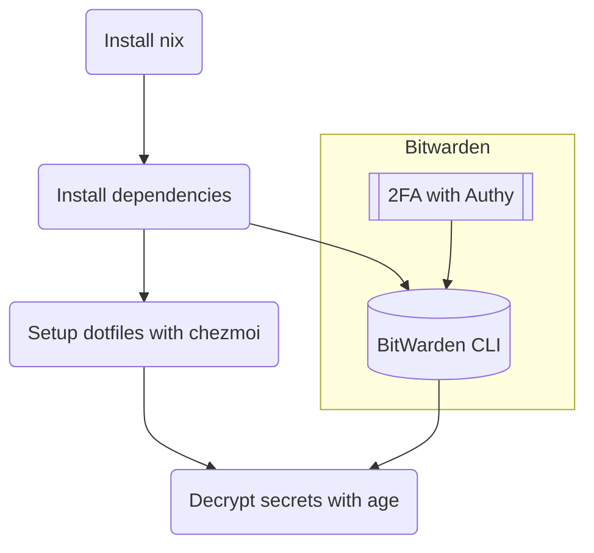

# Tolki's Dotfiles

## TL;DR

### Flow



### Install `nix`

```sh
curl -L https://nixos.org/nix/install | sh -s -- --daemon
```

### Install dependencies

```sh
nix-env -iA \
    nixpkgs.age \
    nixpkgs.atuin \
    nixpkgs.bat \
    nixpkgs.bitwarden-cli \
    nixpkgs.bottom \
    nixpkgs.chezmoi \
    nixpkgs.erdtree \
    nixpkgs.exa \
    nixpkgs.fd \
    nixpkgs.fzf \
    nixpkgs.git \
    nixpkgs.helix \
    nixpkgs.tealdeer \
    nixpkgs.ripgrep \
    nixpkgs.starship \
    nixpkgs.zoxide \
    nixpkgs.zsh
```

If needed, make `zsh` the default shell:

```sh
chsh -s `which zsh`
```

### Setup dotfiles with chezmoi

```sh
export BW_SESSION=$(bw unlock --raw)
bw sync
chezmoi init mrtolkien
chezmoi apply
```

### Additional installs for dev machines

`rtx` for runtime environments management and dev tools:

```sh
curl https://rtx.pub/install.sh | sh
```

TODO: `lazygit`, `python`, `poetry`, `dbmate`, `gh`, `hugo`, `pulumi` can all be installed by both `rtx` and `nix-env`. Which is best for which?

## Software list

TODO: Make software list and explain what they do

Configures and installs:

- [`zsh`](https://www.zsh.org/)
- [`oh-my-zsh`](https://ohmyz.sh/)
- [`zsh-syntax-highlighting`](https://github.com/zsh-users/zsh-syntax-highlighting.git), [`zsh-autosuggestions`](https://github.com/zsh-users/zsh-autosuggestions), [`z`](https://github.com/agkozak/zsh-z), [`zsh-interactive-cd`](https://github.com/changyuheng/zsh-interactive-cd)
- [`fzf`](https://github.com/junegunn/fzf)
- Starship
